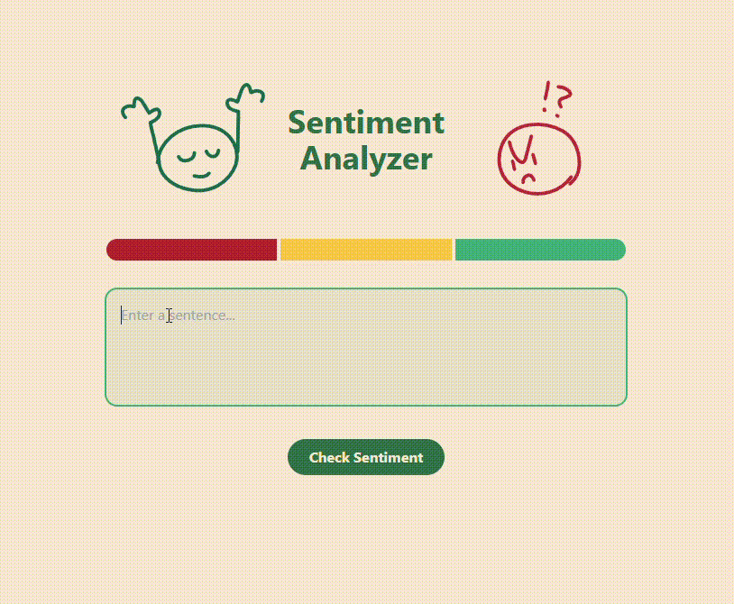

# Sentiment-Analyzer-React-Tailwind-App
A simple and clean web application that analyzes the sentiment of user-input text. Built using React.js and Tailwind CSS, this app offers an intuitive UI where users can enter any sentence and get a visual sentiment response

## 🎬 Demo

